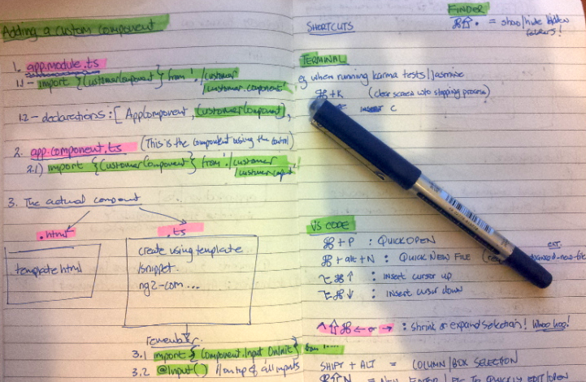
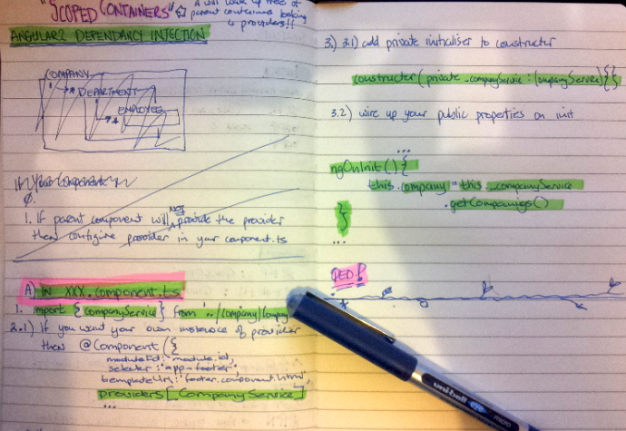
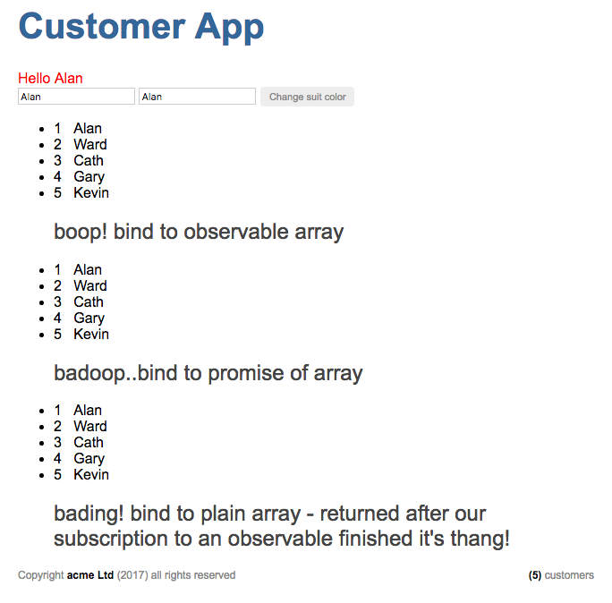

# anguar2 sandbox - quickstart1

Sandbox temporary project. Nothing to see here. (i.e. will be constantly changing while I'm going through the Angular play by play on Pluralsight.) Notes are mostly stuff I had to find out for myself, that are not in the play-by-play, i.e. this is my scratchpad.

[this is my code while I was following along with the play by play, "Angular 2 Quick Start with John Papa and Ward Bell"](https://www.pluralsight.com/courses/play-by-play-angular-2-quick-start-john-papa-ward-bell)

That's not me above, I am neither of those guys, that's John Papa (left) and Ward Bell on right... I was at home watching their Pluralsight video, which I highly recommend, for a superb introduction to the thinking behind how to use Angular 2 in a semi real-ish type way. 


## random notes

### hiding .js and .map files during development

1. install `peep` extension. (`@nwallace`) and configure hidden `.vscode\settings.json` as follows
 
 ```
{
  "typescript.check.workspaceVersion": false,
  "files.exclude": {
    "node_modules/": true,
    "dist/": true,
    "lib/": true,
    "app/*.js": true,
    "app/*.map":true
  }
}
 ```

1. reload vscode.
1. issue command (from command pallette) `peep none` or `peep all`

### note to self, I've moved to writing my notes in A5 handbook

Initially this was a lot more work, but I'm getting used to writing notes manually as I want to keep the book as a reference. (Decided to do this after seeing Ebru Cucen refer to some notes during a discussion and how the manual notes and mind maps were super helpful as a learning aid.) Huh, engage more of the senses.



### todo : adding a custom angular 2 component (notes here)



### todo : dependancy injection notes here

### Angular2 API's, Rx & Observables

#### package.json

1. make sure `rxjs` is referenced. (uppdate version if necessary)
 1. if no `rxjs` is already in `package.json` then run `npm install rxjs` to get latest.

#### main.ts

1. import rx
 1. `import 'rxjs/add/operators/map'` (just the bits you need) or
 1. `import 'rxjs/Rx'`  (everything)

#### customer.service.ts

Inside any component that's consuming a reactive service. (stream?) In this example, we're using the rx map function together with Http, Response

1. add `import 'rsjs/Rx'` to the top of your files. example below I think we could just import 'map'?
1. consume an observable provider, e.g. from Http.get, and return that as the observable type

 ```
  import { Injectable } from '@angular/core'
  import { Http, Response } from '@angular/http'
  import 'rxjs/Rx' 

  const URL_CUSTOMER = 'app/customer.json'

  @Injectable()
  export class CustomerService {
      constructor(private _http : Http) { }
    
      getCustomers() {
          console.log('get customers ()')
          return this._http.get(URL_CUSTOMER)
          .map((response:Response)=> response.json());
      }
  }

 ```

#### customers.component.html

In any component binding to the results of a service, that's now an observable collection:

1. in the component consuming the service response, since the response is now an observable, we need to 
 1. change the types, to `Observable<mytype>`, and 
 1. import `Observable` => `import { Observable } from 'rxjs/Rx';` 
1. convert any `angular` component that binds to an `Observable`, and tag the binding as async
 1. in `customers.component.html` convert 
  1.`<li *ngFor="let c of customers">` to   
  1. `<li *ngFor="let c of customers | async ">`
1. if no secret magic `| async` is added, and you try to bind to an observable you will most likely get the following error, `Cannot find a differ supporting object '[Object Object]' ...NgFor only supports binding to Iterables such as Arrays.`

#### service errors

1. catch errors after calling `map` with `.catch(foo)`

```
 .map((response:Response) => response.json())
  .catch(this._fooErrorHandler);

 _fooErrorHandler() {

 }

```

#### Promises instead of Observables

1. ***boop!*** : binding to observable array (tbd)
1. ***badoop!*** : bind to promise of an array (tbd)
1. ***badang!*** : bind to a plain array - returned after our subscription to an observable collection finished it's thang! 
1. all the above with error handling, phew! awesome.
1. `customers.component.html` no need for change, ` | async` can handle both promises or observables.




#### installing html test reporter

- https://www.npmjs.com/package/protractor-jasmine2-html-reporter

1. `npm install protractor-jasmine2-html-reporter --save-dev`
1. update `protractor.config.js` (as per instructions in link above)

