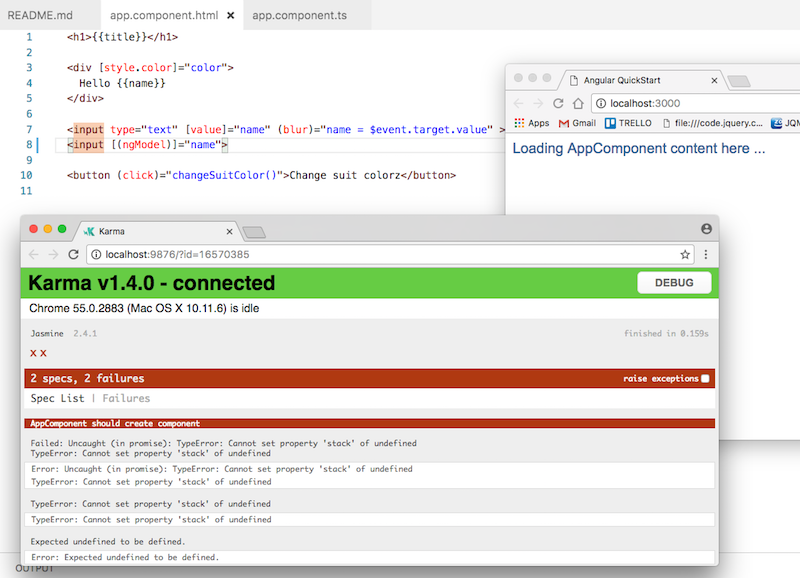

# study-ang2-play-by-play

Small spike  project to test learning angular 2. It's a clone of the angular2 getting started project, with the `non-essential-files.txt` removed, and then manually updated while [I follow the play by play of John Papa and Ward Bell on Pluralsight](https://app.pluralsight.com/library/courses/play-by-play-angular-2-quick-start-john-papa-ward-bell/table-of-contents), but using my own examples and code.


## random notes

These may or may not pan out to be anything. As I'm watching the play by play these are some differences. Noting them here in case something doesnt work as expected and this might have something to do with it.

- no `typings.json` file. Might affect `es6-shim` or `jasmine`.
- no `wallaby.js`

## notes on following step by step

1. running `$> npm start` from terminal window (` control + backtick`) in visual studio code, did not appear to do anything,huh! Possibly a prerequisite, or VScode shell thing. Ah, works from terminal, but not from VSCode shell window.
1. warning in Visual studio code, something about workspace typescript version below that of bundled, choose which you want to use. selected latest version (i.e. bundled and not workspace, huh.)
1. running `$> npm test` failed with error `File ... karma.conf.js` does not exist. (It's possible the extra files list contained this file in the beginning and was deleted?) Ok, going to try create my own karma file.
1. copying the default `app.component.spec.ts` from quickstart results in a non failing tests.
1. Had to start from scratch (and *not* delete the extra files) in order for `npm test` to work. Will go through intro to Jasmine and Karma seperately.
 1. ok, all's well with the world, restoring all the default `non-essential-files.txt` brought the tests back to life. My guess is Angular CLI or You is a better way to kick start an angular project?

### launching the out of box quick start app

1. In the pbp the Unit tests results are a nicely formatted html file `tests.html`, in `quickstart` the test results file is a texd file `protractor-results.txt`. **todo : find out how to configure protractor** to render results as html.

### Testing with Wallabee

1. `wallaby.js` missing, so could not start wallaby after installing extension and `cmd shift equals => start`
 1. installing 'wallaby.js' extension (as a noobie) was a disaster, after messing around and trying to fix few things, (writing a wallaby.js) config, I keep getting `cannot find variable:module` and [FAQ here](https://wallabyjs.com/docs/intro/troubleshooting.html) refers to the `env` `property` which is in the wallaby.js config file. Ok, just don't have time for  this. Wallabee looks excellent, but it's just too much too soon, so will come back when all the other bits and pieces are working. (manual testing without coverage will have to do for now.)
1. On my big screen (40") Karma kicks off the chrome test window from top to bottom, and overlaps a whole bunch of dev windows. This is quite distracting, will be good to google and find out how to configure the size of this window (for a bonus the location as well).
1. Wallabee is currently $100 for a named developer licence. Valid as of 24/1/2017. Does allow you to run with a 30 day trial licence. I've started this, and expect I'll need to ask for an extension whenever I get to reviewing it later.

### Running e2e End-to-end Testing

1. **(!)** `$> npm run e2e` ***fails*** with `make sure you have the latest version of node.js and npm installed`. Huh!
 1. I've definately run `npm run pree2e` and that ran ok, but the above just dies. It does run the tests first, and seems to only die when it gets to rendering the output, maybe this explains the text file? Perhaps the text file is parsed and used as a template to generate the html file, then deleted? Log files would be really helpful, but nadda from what I can see.
 1. Changing the `e2e/app.e2e-spec.ts` to make the test pass, appears to cause the error described above to go away, and at the very least we can temporarily use this as a crude test of passing. **Darn rubbish though, and will have to be fixed!** Might be a clue to the cause obviously.

### Getting started with components and data binding

1. using `systemsj` as the **module loader**.
1. Hmm, will have to come back to this, what's changed in the bootstrap sequence and `main.ts`.
1. Aaaargh, WTF, what just happened? why is this file so screwed up? Oh! Ah,... accidentally clicked the `js` file instead of the `ts` file. Need to watch out for that. 
1. No longer import from the component, default is to now import via the module? okay then.
 1. updated sequence, is cmd-click on `AppModule` then in the module file, cmd-click on `AppComponent` in the bootstrap line.
1. Accidentally hit 'save' with `<button (click)="">` without defining the event handler, and Karma and everything kinda vomited all over everything. The error message was less than useless, huh! `Failed : Uncaught (in promise) TypeError: Cannot set property "stack" of undefined.' Wow, that's just super unfriendly, well, that really just has absolutely no help tracking down the cause. I can see 1) here be dragons, and 2) make sure you're doing TDD, 3) run your tests often, and all the time, ..get into `Wallaby`, and lastly `GIT GIT GIT!` commit-in regularly and often after each passing test. 

### Two-Way Data Binding with ngmod (part1)

1. After creating the component template (html) file, and referencing it, I am not getting my intellisense when I edit the html. *(todo: comeback and find out why?)*
1. `5m48s` (!) this fails `<input type="text" [(ngModel)]="name">` with ... you guessed it, our lovely helpful error message friend, `cannot set property 'stack' of undefined` (I have a hunch, and I don't know angular, however, the docs look like this might hve something to do with dependancies, missing import, possibly some 'Forms' or other )
    
1. [for my reference, here's the shortcut to the new (banana in a box) two way model binding in Angular docs] (https://angular.io/docs/ts/latest/guide/template-syntax.html#!#two-way)

***almost ~~CONCLUSION~~***

This was not a good idea: I thought I could hack Angular and get a quick start by following someone, (the theory is solid), but angular is too fiddly, too many specific conventions, and changing too fast. Better approach is to bite the bullet and skip pluralsight for this, (pluralsight video authors cannot update their material fast enough, or... don't need to? ) Not sure of the game theory behind pluralsight design, but I'd rather some less famous person be paid for a course that's 10 minutes fresh, and 100% up to date, than slog through a really difficult course (that was technically brilliant at the time it was created) but is now full of holes. No fault of the author, other than they're too famouse and busy to keep their material up to date, since their time is money, and I get it, just think that Pluralsight have missed a trick. Perhaps it will come in time, and I'll be able to rate this course, and payment to authors is somehow linked to value created and delivered, and a balance can be struck, so that famouse authors can be hard pressed by new rising talent, who do nothing else, and also have great screen presence, and are inspiring, just more driven and focused to keeping their material up to date because of fewer distractions? this is a hard one, and I really don't want to sound ungrateful.

* Solution? Not sure, as this is challenging the very core value that Pluralsight offers, and if I had to be pressed right now, I'd guess the answer is to A) start with the online documentation, and see what's the recommended training there. Perhaps timebox, allocate 20 minutes to testing different training material and videos from different sources, starting with the recommended courses from the Angular website itself, then compare with the latest submitted courses on pluralsight. (I hate this strategy, because it means that poor content will get better exposure based on who submitted their content the latest, and is subject to easy hacking.) // end footnote.

### Two-way Data Binding with ngmod - continued (part 2)

Ok, I couldn't got to sleep with that error starting at me. Some random digging and experiments, and I found the missing references and what's needed to move forward. (Having the Karma tests running all the time every time I hit save on a document, and also having the browser sync feature so that I can instantly preview changes was a godsend, and saved a ton of time experimenting.) Ok, this is what was missing;

`app,module.ts` needed to reference the FormsModule, and import it, as shown below. (I may have this wrong, this is the hack that worked for me.)
```
import { NgModule }      from '@angular/core';
import { BrowserModule } from '@angular/platform-browser';
import { FormsModule } from '@angular/forms';
import { AppComponent }  from './app.component';

@NgModule({
  imports:      [ 
    BrowserModule,
    FormsModule
    
     ],
  declarations: [ AppComponent ],
  bootstrap:    [ AppComponent ]
})
export class AppModule { }

```
and `app.component.html` to bind using the banana hammock syntax shown in the play-by-play video `<input type="text" [(ngModel)]="name">`

## various references

- [Angular 2 quick start](https://github.com/angular/quickstart)
 
 ```   
for /f %i in (non-essential-files.txt) do del %i /F /S /Q
rd .git /s /q
rd e2e /s /q 
```

- [Play by play : angular 2 Quick start with John Papa and Ward Bell](https://app.pluralsight.com/library/courses/play-by-play-angular-2-quick-start-john-papa-ward-bell/table-of-contents)