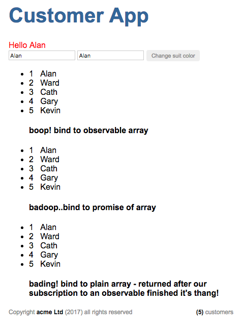

# anguar2 sandbox - quickstart1

Sandbox temporary project. Nothing to see here. (i.e. will be constantly changing while I'm going through the Angular play by play on Pluralsight.) Notes are mostly stuff I had to find out for myself, that are not in the play-by-play, i.e. this is my scratchpad.

[this is my code while I was following along with the play by play, "Angular 2 Quick Start with John Papa and Ward Bell"](https://www.pluralsight.com/courses/play-by-play-angular-2-quick-start-john-papa-ward-bell) intertwined with the Angular Tour of Heroes.


That's not me above, I am neither of those guys, that's John Papa (left) and Ward Bell on right... I was at home watching their [pluralsight play by play video](https://www.pluralsight.com/courses/play-by-play-angular-2-quick-start-john-papa-ward-bell)
, which I highly recommend, for a superb introduction to the thinking behind how to use Angular 2 in a semi real-ish type way. 

## random notes

### hiding .js and .map files during development

1. install `peep` extension. (`@nwallace`) and configure hidden `.vscode\settings.json` as follows
 
 ```
{
  "typescript.check.workspaceVersion": false,
  "files.exclude": {
    "node_modules/": true,
    "dist/": true,
    "lib/": true,
    "app/*.js": true,
    "app/*.map":true
  }
}
 ```

1. reload vscode.
1. issue command (from command pallette) `peep none` or `peep all`

### note to self, I've moved to writing my notes in A5 handbook

Initially this was a lot more work, but I'm getting used to writing notes manually as I want to keep the book as a reference. (Decided to do this after seeing Ebru Cucen refer to some notes during a discussion and how the manual notes and mind maps were super helpful as a learning aid.) Huh, engage more of the senses.


### todo : adding a custom angular 2 component (notes here)


### todo : dependancy injection notes here

### Angular2 API's, Rx & Observables

#### package.json

1. make sure `rxjs` is referenced. (uppdate version if necessary)
 1. if no `rxjs` is already in `package.json` then run `npm install rxjs` to get latest.

#### main.ts

1. import rx
 1. `import 'rxjs/add/operators/map'` (just the bits you need) or
 1. `import 'rxjs/Rx'`  (everything)

#### customer.service.ts

Inside any component that's consuming a reactive service. (stream?) In this example, we're using the rx map function together with Http, Response

1. add `import 'rsjs/Rx'` to the top of your files. example below I think we could just import 'map'?
1. consume an observable provider, e.g. from Http.get, and return that as the observable type

 ```
  import { Injectable } from '@angular/core'
  import { Http, Response } from '@angular/http'
  import 'rxjs/Rx' 

  const URL_CUSTOMER = 'app/customer.json'

  @Injectable()
  export class CustomerService {
      constructor(private _http : Http) { }
    
      getCustomers() {
          console.log('get customers ()')
          return this._http.get(URL_CUSTOMER)
          .map((response:Response)=> response.json());
      }
  }

 ```

#### customers.component.html

In any component binding to the results of a service, that's now an observable collection:

1. in the component consuming the service response, since the response is now an observable, we need to 
 1. change the types, to `Observable<mytype>`, and 
 1. import `Observable` => `import { Observable } from 'rxjs/Rx';` 
1. convert any `angular` component that binds to an `Observable`, and tag the binding as async
 1. in `customers.component.html` convert 
  1.`<li *ngFor="let c of customers">` to   
  1. `<li *ngFor="let c of customers | async ">`
1. if no secret magic `| async` is added, and you try to bind to an observable you will most likely get the following error, `Cannot find a differ supporting object '[Object Object]' ...NgFor only supports binding to Iterables such as Arrays.`

#### service errors

1. catch errors after calling `map` with `.catch(foo)`

```
 .map((response:Response) => response.json())
  .catch(this._fooErrorHandler);

 _fooErrorHandler() {

 }

```

#### Promises instead of Observables

1. ***boop!*** : binding to observable array (tbd)
1. ***badoop!*** : bind to promise of an array (tbd)
1. ***badang!*** : bind to a plain array - returned after our subscription to an observable collection finished it's thang! 
1. all the above with error handling, phew! awesome.
1. `customers.component.html` no need for change, ` | async` can handle both promises or observables.



***todo***

When I have time, update the different (promises) vs observables, and see how the system behaves with a very slow service.

```

  // copied from tour of heroes
  // https://angular.io/docs/ts/latest/tutorial/toh-pt4.html#!#slow

getHeroesSlowly(): Promise<Hero[]> {
  return new Promise(resolve => {
    // Simulate server latency with 2 second delay
    setTimeout(() => resolve(this.getHeroes()), 2000);
  });
}

```

## routing

routing notes go here


1. ***`[index.html]`*** : add base-href to index. `<base href="/">`
1. ***`[app/app.module.ts]`*** : configure your routes
 1. `import { RouterModule, Routes } from '@angular/router';`
 1. add your routes to `@NgModule` -> `imports` 
 
  ```  
  imports: [
    BrowserModule,
    FormsModule,
    RouterModule.forRoot( [
    { path: 'crisis-center', component: CrisisListComponent },
    { path: 'heroes', component: HeroListComponent },
    ])
  ],

  ```

#### removing # from the route

To do: remove the awful # from the routes, ugh! Link below is from angular1, need to find similar angular 2.

- https://scotch.io/tutorials/pretty-urls-in-angularjs-removing-the-hashtag
- update : later the same day. Just built the Tour of Heroes and completed the component router demo, and turns out, there are no more dirty '#' in routing.
- whats more, if you navigate to a saved 'friendly url' the correct controls are shown (enabled etc), so appears to 'just work'...wow!

#### installing html test reporter

- https://www.npmjs.com/package/protractor-jasmine2-html-reporter

1. `npm install protractor-jasmine2-html-reporter --save-dev`
1. update `protractor.config.js` (as per instructions in link above)

### Noobie rants

Ok, I expect I am not alone in this, but oh wait, whaaat?

- Angular2 exception: Can't bind to 'ngForIn'
 - Did someone copyright "for in"? How stunningly amazingly petty to *not* support "for in"? And to top the insult, the error message does not say, we're terribly sorry but please go feck off with your stupid "for in" syntax, ... real men use "for of". Have a nice day, we apologise for testing whether you have full coverage with your e2e tests.

### likes and dislikes ( first impressions ) tbd

ignoring the real technical implementations, this is merely first impressions from a simple user perspective.

- likes
 - routing
  - routes do not have # in the urls
  - opening a page at a route (often) can easily open the SPA at the correct page.
  - super simple syntax for dynamically (loading/unloading) components.
 - style handling. css for components don't 'leak' out into the wild, they stay with the component. (not sure if this is really an angular benefit, or just me being naieve.)
 - typescript support. Easily follow tour of heroes using VSCode with only a few plugins and it's all working, and working really well.
 - quickstart template seems (at first glance) pretty decent, with a very simple `npm` process that works well for noobies.
 - service injection works well, simple use case in the demo shows it to be super straight forward, and love how angular will automatically walk up the components to find if a parent can provide a service, ... very simple.  
 - does not (appear) to have a very heavy build process, compared to other frameworks.

- dislikes
 - error messages
 - Not sure about this, need to do some investigation : but looking at the error messages, not sure the details of what is actually going on is something mortals will really be able to dive into.
 - duplication of effort in configuration. Far too much 'importing', framework should be able to determine what components are available based on convention.
 - barrels seem redudant? same point as above, band-aid on a gunshot wound. 
 - Barrels appear to simply be a single place you can reference to then import multiple stuffs, so you still can end up with many lines of imports? (afaik)
 - components don't feel as encapsulated as they look when you still have to 'wired them up' in seemingly pedantic ways.
 - first look it seems like api is changing frequently, meaning you can't use anything but the tour of heros documentation. Undermines some really good work being done by Pluralsight authors et al.
 - not sure how much I can really absolutely trust the developers. NgFor syntax binding changed at the 12th hour, only 3 months (??) before version 4 is due out? (skipping version 3)
 - quickstart folder structure is messy. (I dont think this is a criticism of angular, just the quickstart) Too many configuration files in the root. 
 - Without peep, (to hide all the .map and .js) files, editing even a small project becomes unmanagable. Was expecting barrels to be a way to truly build and test encapsulated nuget style packages I can 'import', not so.


### stopping

- stop at Milestone #3 : the heroes feature (routing and navigation)
- https://angular.io/docs/ts/latest/guide/router.html#!#base-href


